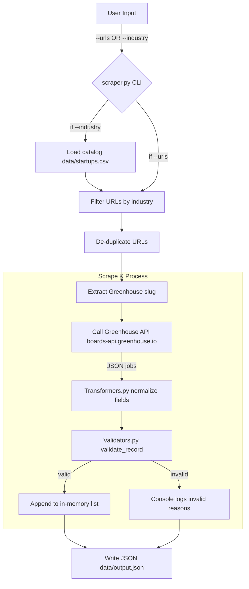

# 📊 Startup Hiring Trends Radar

## 📌 Executive Summary
This project builds a **web scraper for startup career pages** (currently focused on companies using **Greenhouse** as their applicant tracking system).  
The motivation is to provide a **Hiring Trends Radar** that delivers insights for **investors, recruiters, and educators**:
- Which startups are actively hiring
- Industry-specific growth signals
- Data-driven patterns on job roles, locations, and hiring velocity  

The scraper is **not production-grade** but demonstrates:
- API-first respectful scraping
- Data validation & transformation
- Ethical + legal considerations in web scraping  

---

## 🏗 Technical Architecture



## ⚙️ Setup & Deployment

### 1. Clone the Repository
```bash
git clone https://github.com/Amyliao0/Project-2.git
cd Project-2
```

### 2. Create & Activate Virtual Environment
```bash
python3 -m venv .venv
source .venv/bin/activate   # Mac/Linux
.venv\Scripts\activate      # Windows PowerShell
```

### 3. Install Dependencies
```bash
pip install -r requirements.txt
```

### 4. Run the Scraper
```bash
Option A – Scrape by URL(s)
python src/scraper.py --urls https://boards.greenhouse.io/keebo --out data/output.json

Option B – Scrape by Industry (using catalog)
python src/scraper.py --industry ai --catalog data/startups.csv --out data/ai_jobs.json

```

## 5. Output

### JSON file is written to data/ (e.g. data/output.json, data/ai_jobs.json)

Each record contains:

- title → job title

- location → job location

- date → posting or update date

- url → application link

- company → startup name

